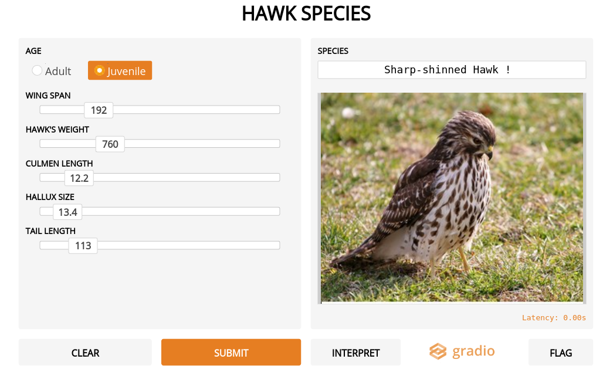

# Hawk Classification Model

## Introduction
This is a machine learning model used to classify hawks into 3 species - Cooper's hawk, Red Tailed hawk and Sharp Shinned hawk. This classification is done based on features like age, wingspan, weight, culmen length, hallux size and tail length.

</img>
## Dataset
The data was collected by students and faculty at Cornell College in Mount Vernon, Iowa. It observed characteristics like age, wingspan, weight, culmen size, hallux, tail length, wing, sex, species, tarsus, capture time, release time, keelfat and crop of hawk species in and around Iowa. Over 900 cases were recorded with almost 19 characteristics and were categorised into mainly 3 species - Cooper's hawk, Red Tailed Hawk and Sharp Shinned hawk. The dataset used to train this respective model is a simplified and smaller version of the same with fewer number of characteristics taken into consideration.

## Algorithm
It is evident from the graph shown below that the data is linearly separable. Therefore logistic regression is used to classify the hawks into 3 different species.

</img>
## Working
The independent variables are age (adult or juvenile), wingspan, weight, culmen length, hallux size and tail length. The dependent variable is the species of hawk.

The accuracy of the trained model is 95%.
## Conclusion
Therefore, we conclude that features like age, wingspan, weight, culmen length, hallux size and tail length can be used to accurately classify hawks into Cooper's, Red Tailed and Sharp Shinned hawk.
